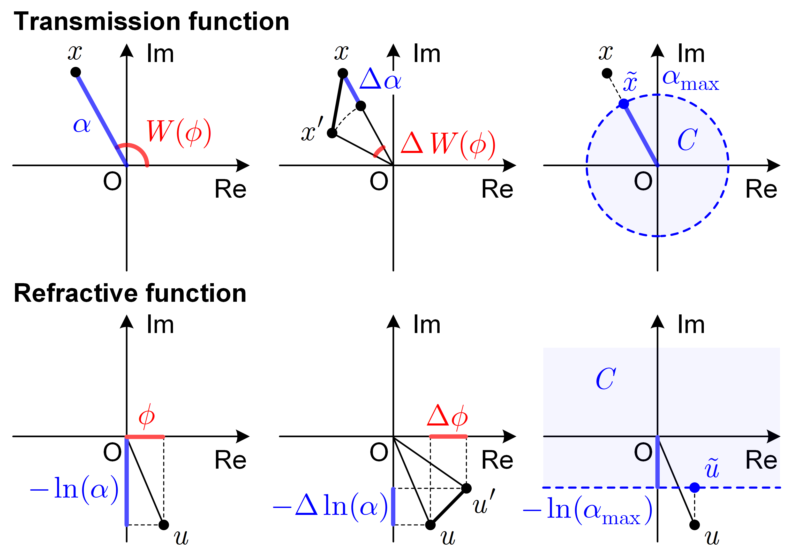

# Projected refractive index framework for phase retrieval
Authors: **[Yunhui Gao](https://github.com/Yunhui-Gao)** (gyh21@mails.tsinghua.edu.cn) and **[Liangcai Cao](https://scholar.google.com/citations?user=FYYb_-wAAAAJ&hl=en)** (clc@tsinghua.edu.cn)

## Introductioin

Multi-wavelength phase retrieval provides a competitive solution to lensless holographic imaging that features a low cost, compact design, and high data acquisition speed. However, the existence of phase wraps poses a unique challenge for iterative reconstruction and the resulting algorithms often suffer from limited generalizability and increased computational complexity. Here, we propose a projected refractive index framework for multi-wavelength phase retrieval that directly recovers the amplitude and unwrapped phase of the object. General assumptions are linearized and integrated into the forward model. Based on an inverse problem formulation, physical constraints and sparsity priors are incorporated, which ensures imaging quality under 
noisy measurements. We experimentally demonstrate high-quality quantitative phase imaging on a lensless on-chip holographic imaging system using three color LEDs.

Figure 1. Illustrative comparison between the transmission function $x$ and the refractive function $u$. Left column: relations to the amplitude $\alpha$ and phase $\phi$, where $W$ denotes the phase wrapping operation. Middle column: finite difference calculation, where $x'$ and $u'$ denote the transmission function and the refractive function of the adjacent pixel, respectively. Right column: enforcing the absorption constraint via projection, where $\tilde{x}$ and $\tilde{u}$ denote the projected transmission function and refractive function, respectively.

Figure 2. Reconstruction process of a simulated virtual phase object with a maximum optical path length (OPL) of 300 nm.

Figure 3. Reconstruction process of a simulated virtual phase object with a maximum OPL of 1500 nm.

Figure 4. Reconstruction process of a phase resolution target from noisy intensity images using the transmission model and the refractive model, respectively.

Figure 5. Reconstruction process of a microlens array using the transmission model and the refractive model, respectively.

## Requirements

* **Matlab:** 2019a or newer. Older visions may be sufficient but have not been tested. 
* **OS:** Win 10 or newer (if using PUMA for phase unwrapping).

## Quick Start
Run `demo_sim.m` with default parameters.

## Theories and References
For algorithm derivation and implementation details, please refer to our paper:

- [Yunhui Gao and Liangcai Cao, "Projected refractive index framework for multi-wavelength phase retrieval," Opt. Lett. 47, 5965-5968 (2022)](https://doi.org/10.1364/OL.476707).